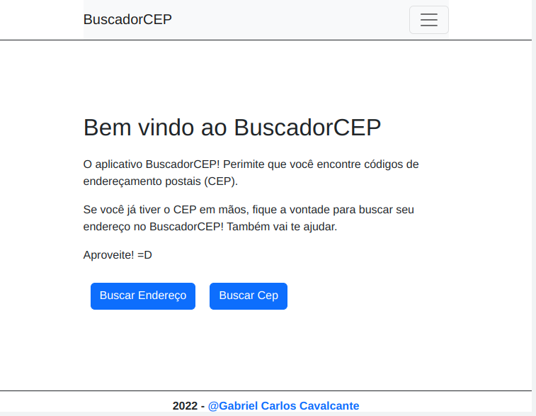
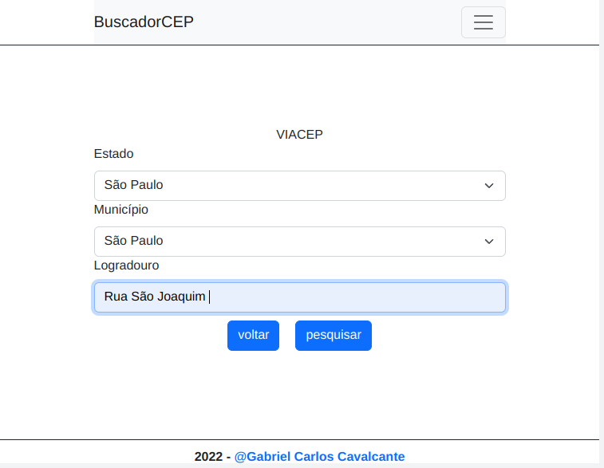
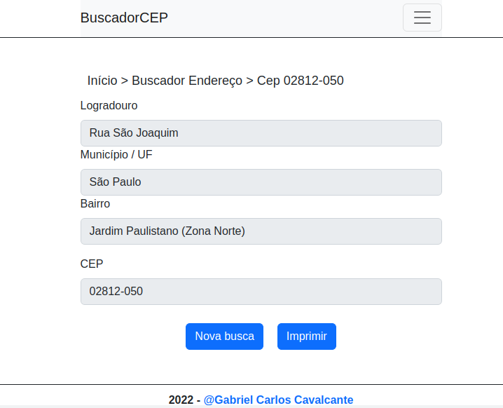
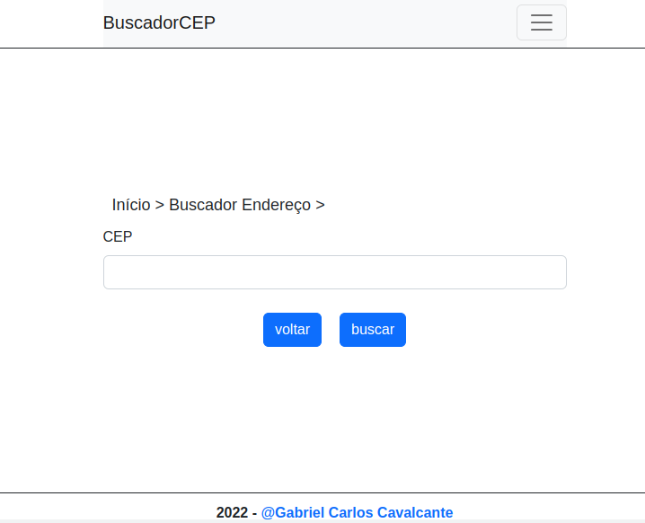
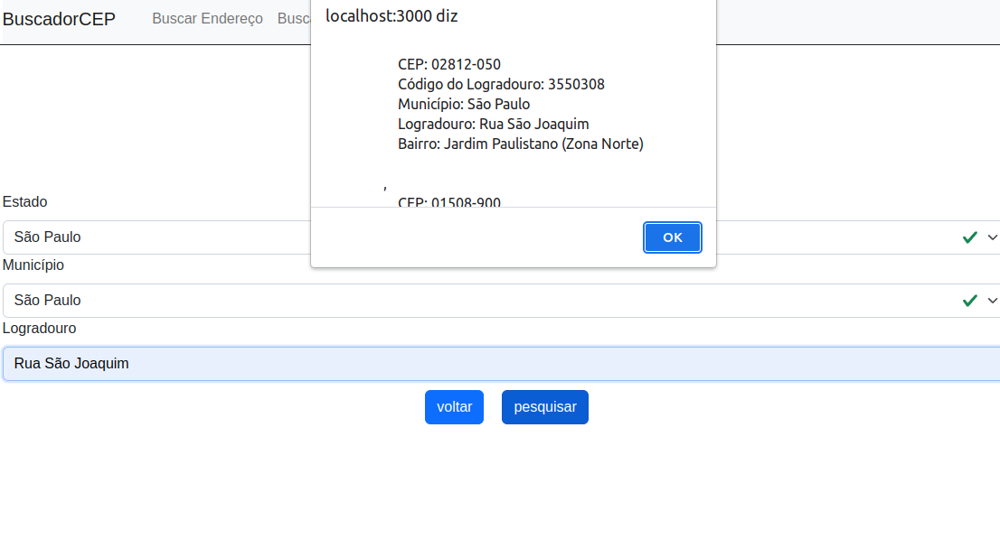

# BuscadorCEP
Esse e um projeto que consome dados do IBGE e VIACEP. Possui duas funcionalidades, buscar o cep de um endereço e pesquisar pelo CEP o endereço. 

## Como foi desenvolvedor? 
 Utilizei o <a href="https://pt-br.reactjs.org/" target="_black">REACT</a> para desenvolver todo o site. Usei <a href="https://styled-components.com/" target="_black">styledComponents </a>,<a href="https://axios-http.com/ptbr/docs/intro"> axios </a>para me auxiliar no processo.

 ## API

- APIs para consumo: 
 
  ViaCEP - https://viacep.com.br/ 
  
  IBGE - https://servicodados.ibge.gov.br/api/docs/localidades


## TELA HOME

## TELA Buscar CEP


# TELA Buscar CEP 



## Como rodar o projeto?

Você precisa ter o [Node](https://nodejs.org/en/), o [Git](https://git-scm.com/) e algum gerenciador de pacotes([NPM](https://docs.npmjs.com/downloading-and-installing-node-js-and-npm/) | [Yarn](https://classic.yarnpkg.com/lang/en/docs/install)) instalados em sua máquina.

```bash
1. Clone o repositório:
$ git clone https://github.com/Gabrielttbr/BuscadorCEP.git
2. Acesse a pasta e instale as dependências via terminal:
$ yarn / npm install
3. Inicie a aplicação em modo de desenvolvimento:
$ yarn start / npm run start
4. O servidor será aberto em http://localhost:3000
```
Após realizar esse passo a passo o projeto estara rodando!

